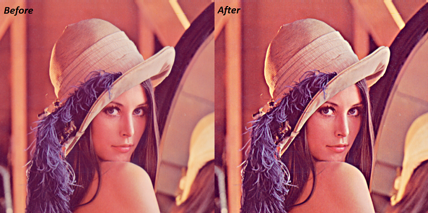
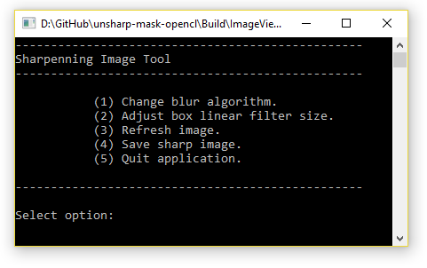

# Sharp Image

Accelerated unshapr mask algorithm to create a sharp image by subtracting the blurred version from the original image.

## Introduction

TODO: Add description.

## Requirements

- CMake v3.7 – generate project files
- Visual Studio 14 – development environment
- Docopt – library to create a user command line support for the application
- OpenCL-HPP - C++ header file for OpenCL functions
- OpenCL-Headers - C header files for OpenCL
- OpenCL-ICD-Loader - mock OpenCL driver for development
- VC++ v19 – compiler with C++ 11 features

## Build Application

TODO: Add description.

## How to Run

TODO: Add description.

## Screenshots

Screenshot 1

Screenshot 2

