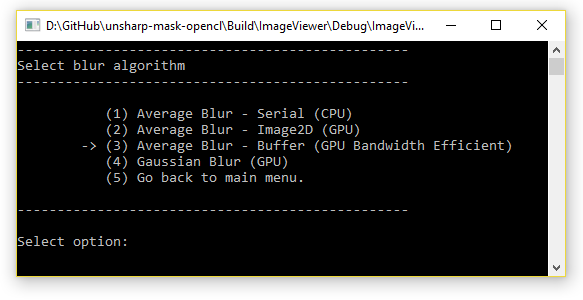

# Sharp Image

Accelerated unsharp mask algorithm to sharpen an image by subtracting the blurred version from the original image.

## Introduction

The project entails an analysis and comparison of the unsharp mask algorithm used for sharpening images and implemented both on CPU and GPU. Execution times are evaluated for the two approaches and possible improvements are suggested. Furthermore, different parts of the CPU serial code are examined to determine which ones can benefit from running on the GPU instead. 

## Requirements

- CMake v3.7 – generate project files
- Visual Studio 14 – development environment
- Docopt – library to create a user command line support for the application
- OpenCL-HPP - C++ header file for OpenCL functions
- OpenCL-Headers - C header files for OpenCL
- OpenCL-ICD-Loader - mock OpenCL driver for development
- VC++ v19 – compiler with C++ 11 features

## Build Application

To build the project, the first step is to install the dependencies. The script is located in the project folder Dependencies and it can be configured with CMake using the following command:

```
cmake -G “Visual Studio 2014” -B./Build/Dependencies -H./Dependencies
```

After the project configuration and the Visual Studio projects are generated, the following command is run to build and install each project in the **Build/Dependencies/Install** folder.

```
cmake --build ./Build/Dependencies --target all --config Debug
```

The same steps are run for the project but in a different location.

```
cmake -G “Visual Studio 2014” -B./Build -H./
cmake --build ./Build --target ImageViewer --config Debug
```

An executable file will be available in the **Build/ImageViewer/Debug** folder. The build files contain two other scripts to package the project or to install the header files with the library project in a specific location.

## How to Run

The application run arguments are kept in the same format as the original code. The command line parsing is implemented using the Docopt library which allows the developer to define an interface of command patterns and make the code behave according to the user input.
The following list shows the command arguments available to the user:

-	**serial <input_file> <output_file>** - run the sharpening process on the CPU initially and optionally select a box linear filter for the blurring algorithm using the **--radius** option.
-	**parallel <input_file> <output_file>** - run the sharpening process on the GPU initially and optionally select a box linear filter for the blurring algorithm using the **--radius** option.

The console window will provide an interactive menu to select a different blurring algorithm, change the box linear filter (radius), save the resulted image or generate the image again (refresh).

#### Main Menu

- (1) Change blur algorithm.
- (2) Adjust box linear filter size.
- (3) Refresh Image
- (4) Save sharp image.
- (5) Quit application.

#### Select Blur Algorithm

- (1) Average Blur - Serial (CPU)
- (2) Average Blur - Image2D (GPU)
- (3) Average Blur - Buffer (GPU Bandwith Efficient)
- (4) Gausian Blur (GPU)
- (5) Go back to main menu.

#### Select Blur Filter Size

- (1) 3 pixels (5x5 box linear filter)
- (2) 5 pixels (9x9 box linear filter)
- (3) 7 pixels (13x13 box linear filter)
- (4) 11 pixels (21x21 box linear filter)
- (5) 13 pixels (25x25 box linear filter)
- (6) Go back to main menu.

## Screenshots

Screenshot 1


Screenshot 2


Screenshot 3

